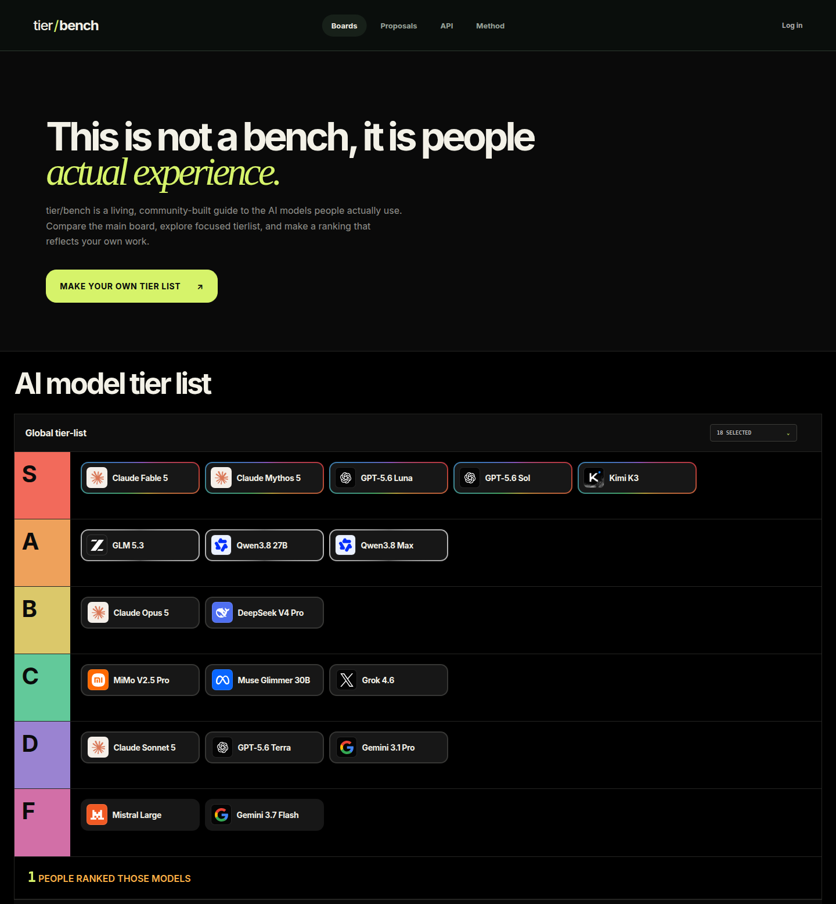
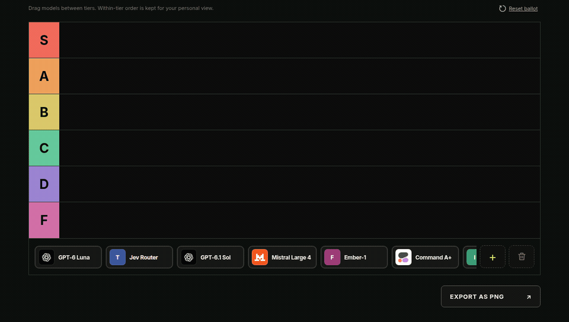
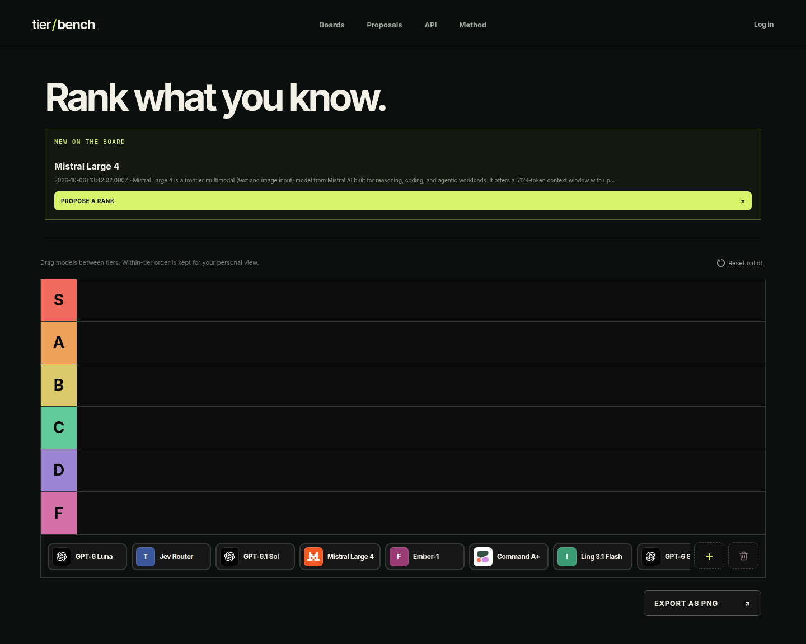
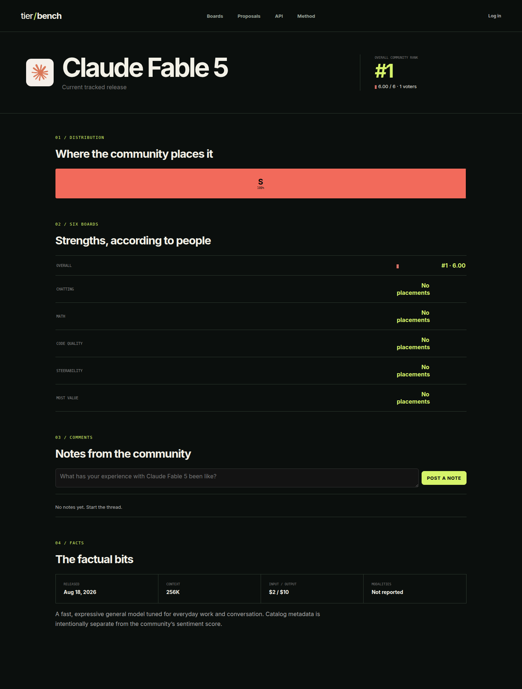
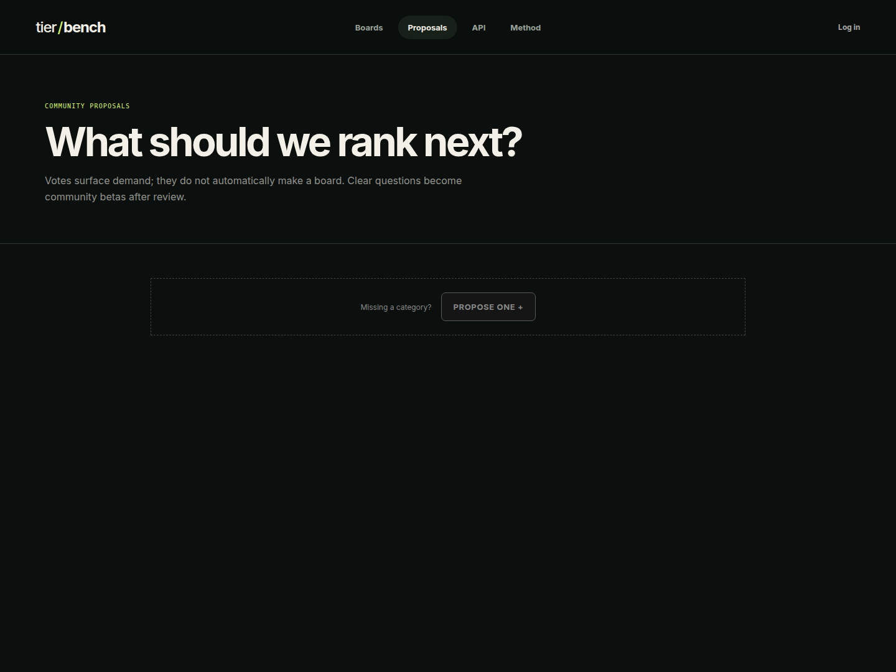
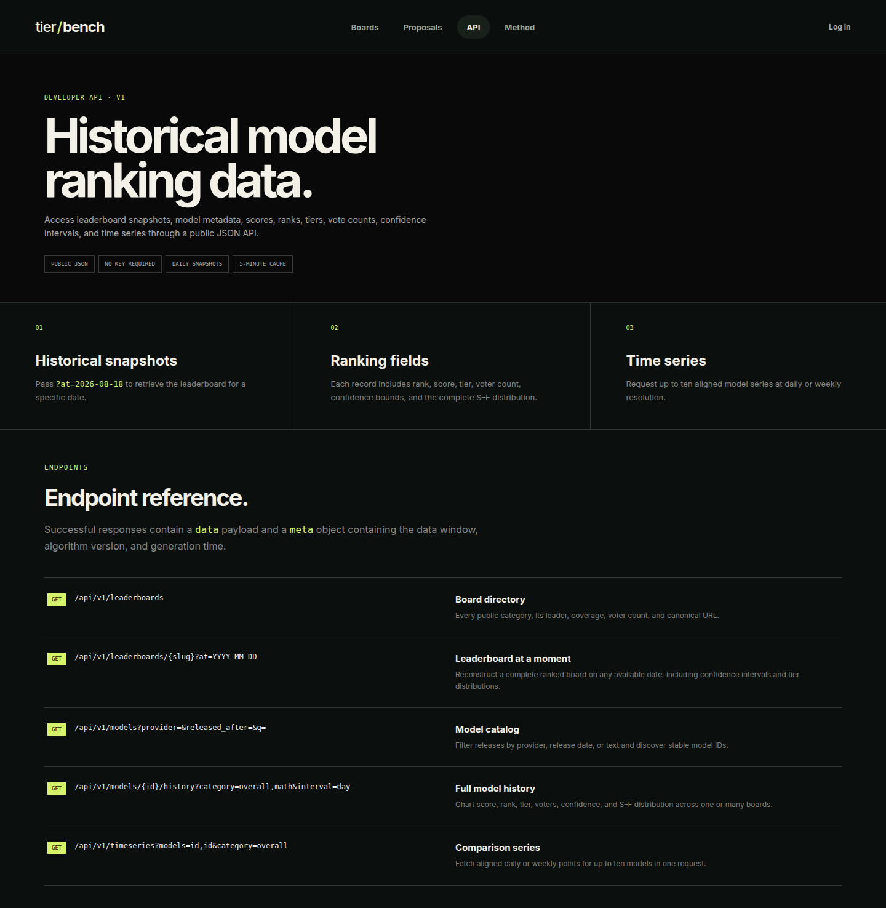
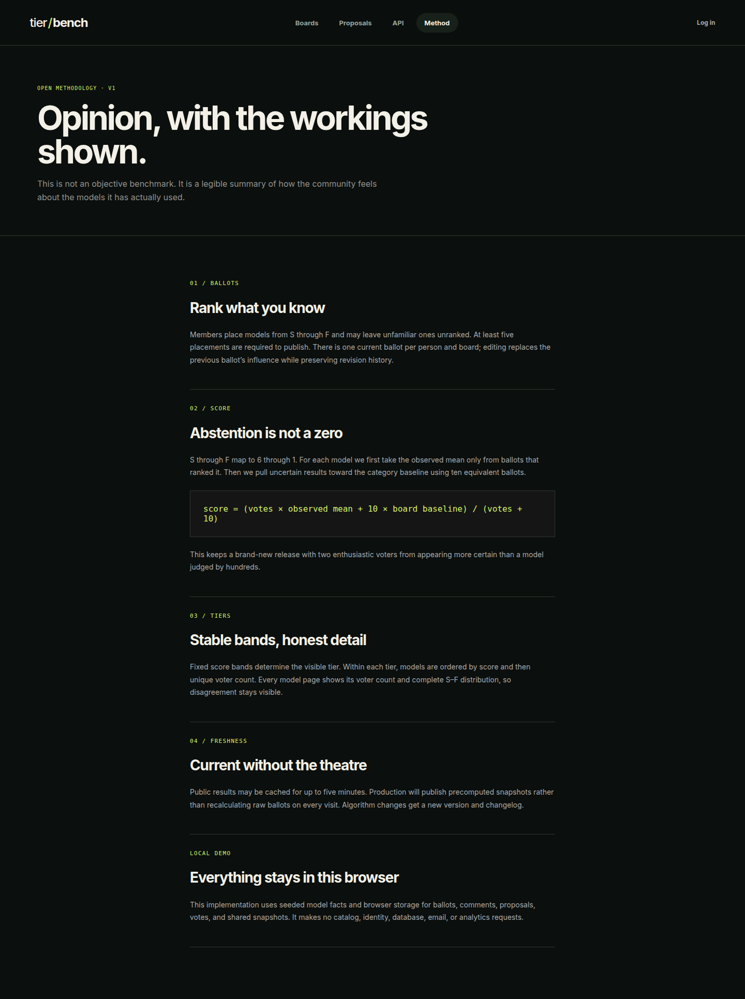

# tier/bench

**[tierbench.calgarypermit.ca](https://tierbench.calgarypermit.ca)**

tier/bench is a community tier list for AI models. People rank the models they have actually used, and the site turns those ballots into public boards. It is a record of sentiment, with the scoring rule written down, rather than an objective benchmark.



Screenshots below were taken from that live site while signed out.

## What you can do

The app ships six boards. Each one asks a specific question:

| Board | Question |
| --- | --- |
| Overall | Rank models by the whole experience: capability, reliability, taste, and how often you actually want to use them. |
| Chatting | Which models are thoughtful, natural, interesting conversation partners? |
| Math | Rank mathematical reasoning, accuracy, and the usefulness of the explanation. |
| Code quality | Rank correctness, maintainability, judgment, and usefulness on real software work. |
| Steerability | How reliably does the model follow an instruction, adopt a style, and change course when corrected? |
| Most value | Rank how much practical value each model delivers for its price and access level. |

On the home page, the Overall board is the main tier list. Further down, the same models are shown across all six boards, and choosing a board focuses that list. A control on the page chooses which models are drawn; that choice stays in the browser.

The ranking editor is the core interaction. Drag a model between tiers, or drag it within a tier to set a personal order. A click cycles a model through S, A, B, C, D, F, and back to unranked. Unfamiliar models can stay unranked. Models can be hidden on this browser, and the ballot can be reset. A wide screen starts with the 20 newest releases; a narrow screen starts with 10. More models can be added from the catalog.





Saving requires a signed-in account and at least five ranked models. There is one current ballot per person and board. A save replaces that ballot and appends an immutable revision, so editing updates that person’s influence and keeps the history. Until sign-in, the draft lives in the browser. When a Turnstile site key is configured, the save also waits for a completed challenge. **Export as PNG** downloads a picture of the personal board.

A model page shows the current community rank, the S–F distribution, the model’s place on all six boards, notes from signed-in members, and catalog facts (release, context, price, modalities). Notes are shown as “Anonymous member.”



Anyone can propose another board. Signed-in members can file a proposal and cast one toggleable vote. Votes record demand. They do not create a board by themselves.



A public JSON API, version `1.0`, needs no key:

- `GET /api/v1/leaderboards`
- `GET /api/v1/leaderboards/{slug}` with an optional `at=YYYY-MM-DD`
- `GET /api/v1/models`
- `GET /api/v1/models/{id}/history`
- `GET /api/v1/timeseries` for up to ten models

Each of those responses sets a five-minute shared cache. The in-app reference is at `/api`.



The methodology page is at `/methodology`.



## How a ranking becomes a score

A placed model is stored as S, A, B, C, D, or F. Those tiers score 6, 5, 4, 3, 2, and 1. The board score is the mean of the current ballots that placed that model. Leaving a model unranked leaves it out of the mean. The tier drawn on the board comes from fixed bands: 5.5 and above is S, 4.5 is A, 3.5 is B, 2.5 is C, 1.5 is D, and anything lower is F. Order inside a personal tier is kept for that person’s editor. The published score uses the tier value only.

The methodology page also describes a shrinkage step: ten equivalent ballots pulled toward the board’s baseline, `(votes × observed mean + 10 × board baseline) / (votes + 10)`. The live boards and the history API publish the observed mean. Responses label that rule `revision-mean-v1`.

The history API rebuilds a UTC day from the latest revision of each ballot that existed at the end of that day. It orders models by score, then by how many ballots placed them. When at least two ballots placed a model, the payload includes a 95% interval: 1.96 times the sample standard deviation, divided by the square root of the ballot count, clamped to the 1–6 score range.

The catalog starts from the product lines in `app/data.ts`. A protected sync can import newer text models from OpenRouter’s public catalog. That job is off unless `OPENROUTER_CATALOG_SYNC_ENABLED` is turned on, and the route accepts either `CRON_SECRET` or a Clerk user id listed in `ADMIN_CLERK_USER_IDS`.

## Stack

- [Next.js](https://nextjs.org/) 16 and React 19, in TypeScript
- PostgreSQL, via the `postgres` driver
- [Clerk](https://clerk.com/) for accounts
- Cloudflare Turnstile on writes, when the keys are set
- OpenRouter’s public model catalog for imports

Production runs the Next.js standalone server. See [docs/deployment.md](docs/deployment.md).

## Run it locally

Use Node.js 22.

```sh
npm ci
```

Create a Postgres database, then copy `.env.example` to `.env.local` and set the variables below. Next.js loads `.env.local` for `npm run dev`. Do not commit that file.

Apply the schema and start the app:

```sh
npm run db:migrate
npm run dev
```

Open [http://localhost:3000](http://localhost:3000).

`npm run lint` typechecks the project. `npm run test:integration` runs the tests in `tests/`. Cases that talk to Postgres run when `DATABASE_URL` points at a migrated database, and they are skipped otherwise. `tests/db-migrations.test.mjs` is separate and requires `DATABASE_URL`.

### Environment variables

Names only. Values stay in `.env.local` or the production env file.

Required to sign in and save ballots:

- `DATABASE_URL`
- `NEXT_PUBLIC_CLERK_PUBLISHABLE_KEY`
- `CLERK_SECRET_KEY`

Used for the public URL and Clerk’s routes:

- `NEXT_PUBLIC_APP_URL`
- `NEXT_PUBLIC_CLERK_SIGN_IN_URL`
- `NEXT_PUBLIC_CLERK_SIGN_UP_URL`
- `NEXT_PUBLIC_CLERK_SIGN_IN_FALLBACK_REDIRECT_URL`
- `NEXT_PUBLIC_CLERK_SIGN_UP_FALLBACK_REDIRECT_URL`

Optional:

- `NEXT_PUBLIC_TURNSTILE_SITE_KEY`
- `TURNSTILE_SECRET_KEY`
- `CRON_SECRET`
- `ADMIN_CLERK_USER_IDS`
- `OPENROUTER_CATALOG_SYNC_ENABLED`
- `OPENROUTER_MIN_CATALOG_MODELS`
- `DATABASE_POOL_MAX`
- `NODE_ENV`
- `NEXT_TELEMETRY_DISABLED`

Production Compose also reads `APP_PORT` and `APP_HOSTNAME`.
